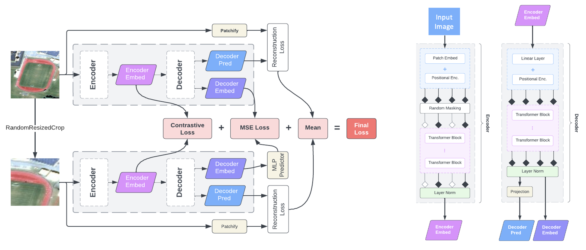

# Cross-Scale MAE (NeurIPS 2023)

<p align="center">
  
</p>

Authors: [Maofeng Tang](https://www.linkedin.com/in/maofeng-tang-40a5ab276/) · [Andrei Cozma](https://www.linkedin.com/in/andreicozma1/) · [Konstantinos Georgiou](https://www.linkedin.com/in/gkos/) · [Hairong Qi](https://www.linkedin.com/in/hairong-qi-6a67602/)

This is a PyTorch implementation of our NeurIPS 2023 paper: [Cross-Scale MAE: A Tale of Multi-Scale Exploitation in Remote Sensing](https://openreview.net/forum?id=5oEVdOd6TV)

## Pretraining

The run the pretraining on a single node, you can use use the the [train.sh](train.sh). Make sure you modify its contents to match your environment. Alternatively, you can use the [main_pretrain.py](main_pretrain.py) directly.

For multi-gpu training, use the [train_distributed.sh](train_distributed.sh) instead.

### Finetuning & Linear Probing

To run finetuning on a single node, you can use the [finetune.sh](finetune.sh). Make sure you modify its contents to match your environment. Alternatively, you can use the [main_finetune.py](main_finetune.py) directly.

For linear probing, use the [linprobe.sh](linprobe.sh) and [main_linprobe.py](main_linprobe.py) instead.

### Model Weights

Pretrained weights for the models used in the paper can be found here:

<table><tbody>
<th valign="bottom"></th>
<th valign="bottom">epochs</th>
<th valign="bottom">pre-trained checkpoint</th>
<th valign="bottom">md5</th>
<!-- TABLE BODY -->
<tr><td align="left">ViT-Base</td>
<td align="center"><tt>400</tt></td>
<td align="center"><a href="https://drive.google.com/file/d/17FePR5lAFNL45g7738JMofP2pyC_6hau/view?usp=sharing">download</a></td>
<td align="center"><tt>0c33995da85c112d9602f89d5b186bbc</tt></td>
</tr>
<tr><td align="left">ViT-Large</td>
<td align="center"><tt>400</tt></td>
<td align="center"><a href="https://drive.google.com/file/d/1FBJiQ8Z6J3P8Le7wFQXOicTDX9jTNGnT/view?usp=drive_link">download</a></td>
<td align="center"><tt>e6e4f58c07bbbc4c4dd63fa26c644dd4</tt></td>
</tr>
</tbody></table>

You would need to download the weights and place them in a folder named `weights` in the root of the repository.

## Acknowledgements

Code from this repository is inspired from the following repositories:

- [SatMAE (NeurIPS 2022)](https://github.com/sustainlab-group/SatMAE)
- [Masked Autoencoders (MAE)](https://github.com/facebookresearch/mae)

## Citation

If you found our project helpful, please cite our paper:

```latex
@inproceedings{tang2023cross,
  title={Cross-Scale MAE: A Tale of Multiscale Exploitation in Remote Sensing},
  author={Tang, Maofeng and Cozma, Andrei Liviu and Georgiou, Konstantinos and Qi, Hairong},
  booktitle={Thirty-seventh Conference on Neural Information Processing Systems},
  year={2023}
}
```

## License

This project is under the CC-BY-NC 4.0 license. See [LICENSE](LICENSE) for details.
